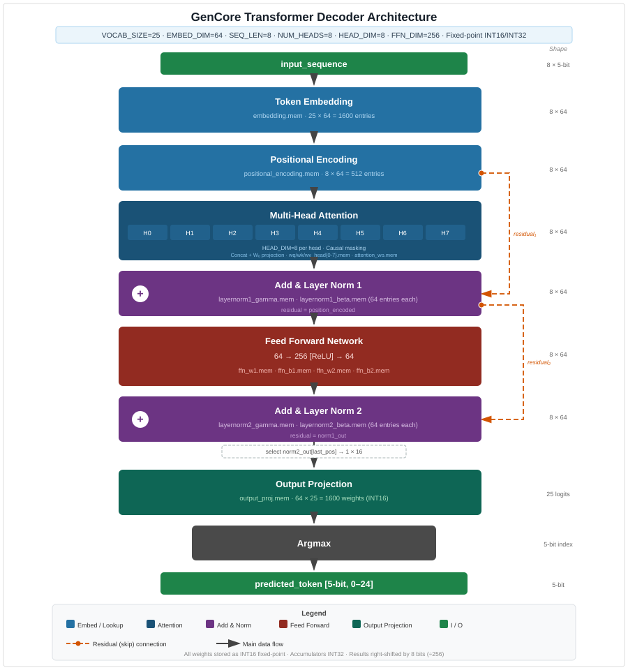

# Repository Selection and Starting Point

## Finding a Starting Repository

To start, I looked for an existing transformer accelerator design that I could use as a starting point. This design needed to fully accelerate the running of the transformer model, and it needed to be simple enough for me to understand and alter. The first design I found that fit these requirements was the GenCore transformer decoder, which implements the entire multi-head attention architecture using 16-bit fixed-point arithmetic.

<!-- TODO (Nicholas): Expand on what you were looking for and why GenCore stood out.
  - What other repositories did you consider? What disqualified them?
  - What specifically made GenCore seem like a good fit?
  - Was there anything about the repository that seemed off from the start (the odd commit history, all code in one file)?
-->

## Hardware Design Overview

The GenCore transformer decoder is built from a set of modules. The most basic is `memory_module`, a generic synchronous read-only memory implementation used throughout the design. Address width, data width, and depth are all configurable parameters, as is the `.mem` file used to initialize the memory contents. There is a single-cycle latency between an address request and the output value.

The `token_embedding` module is a lookup table for token embedding vectors, loading from an `embedding.mem` file stored in a `memory_module` instance. The `positional_encoding` module similarly loads precomputed positional encoding values from a `.mem` file, adding them to each embedded token vector in the current sequence.

Multi-head attention is implemented in `multi_head_attention`, which instantiates one `attention_head` sub-module per head. Each head calculates Q, K, and V matrices from weight memories, computes attention scores, and passes them through an `enhanced_softmax` module that uses a piecewise linear approximation of the exponential function. The outputs are used to compute a weighted sum; `multi_head_attention` then concatenates all head outputs and multiplies by a learned projection weight.

The attention output passes through `layer_normalization` (using precomputed gamma and beta parameters), then through `feed_forward_network` (a two-layer MLP with ReLU activation), then through a second `layer_normalization`. The final normalized output goes into `output_projection`, which multiplies by a learned weight matrix to produce vocabulary-sized logits. `argmax` selects the highest-logit token. The entire pipeline is coordinated by `complete_transformer_decoder`.

## What the Repository Provided

Beyond the RTL, the GenCore repository included a Python training script and a script for comparing hardware logits against the software model. The training script ran on 24 hardcoded sentences for 100 epochs, then quantized and exported weights to `.mem` files. The comparison script generated plots of hardware vs. software logits.

## What Was Missing or Broken

Getting the design to synthesize and place on the target board required several categories of work beyond what the repository provided:

**No constraint file.** The original design included no XDC constraint file for the PYNQ-Z1. One had to be created to map the design's ports to the board's physical pins and set timing constraints.

**No board interface.** The design had no mechanism for communication with the PYNQ-Z1's ARM processing system. The PYNQ-Z1 uses an AXI-Lite interface for PS-to-PL communication, so a wrapper module was written to bridge the top-level design to this memory-mapped interface, enabling Python control from the ARM side.

**Code errors.** Multiple errors were present in the original RTL that required correction before synthesis would succeed. These are documented in detail in Section 5b.

**Insufficient training data.** Twenty-four training sentences is far too small a dataset for any statistical comparison to be meaningful — the model would simply memorize the training set. The training pipeline was substantially expanded (see Section 4).

**Excessive LUT utilization.** Initial synthesis with the default parameters showed approximately 220% LUT utilization — more than twice the PYNQ-Z1's capacity. Significant parameter reduction and architectural work was required to fit the design on the board (see Section 5a).

<!-- TODO: Add a brief table summarizing original parameters vs. what would fit:
  Original: NUM_HEADS=8, EMBED_DIM=64, FFN_DIM=256, SEQ_LEN=8, VOCAB_SIZE=40
  Final: NUM_HEADS=4, EMBED_DIM=16, FFN_DIM=32, SEQ_LEN=8, VOCAB_SIZE=40
-->
