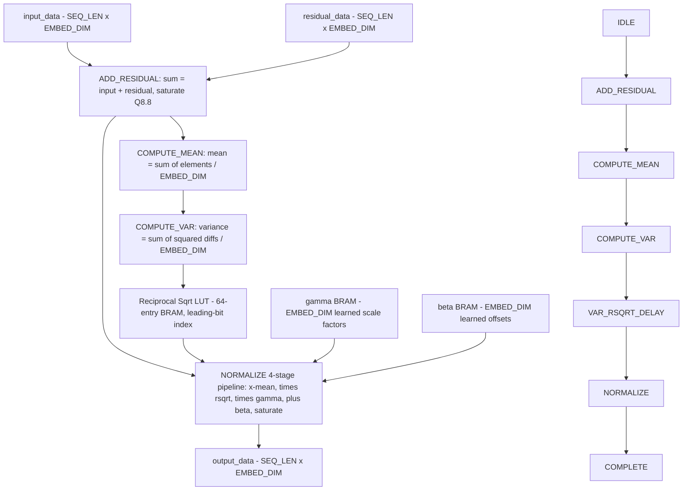
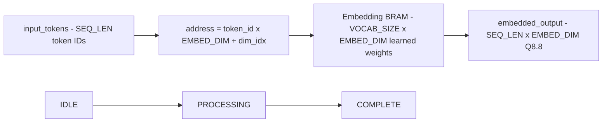
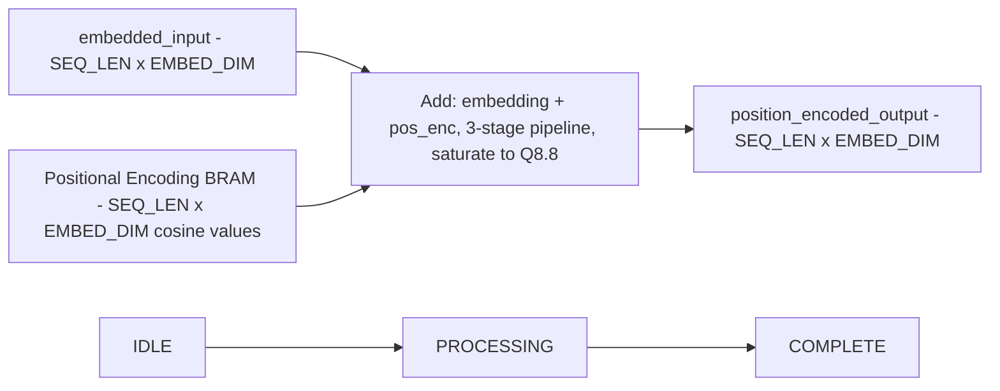
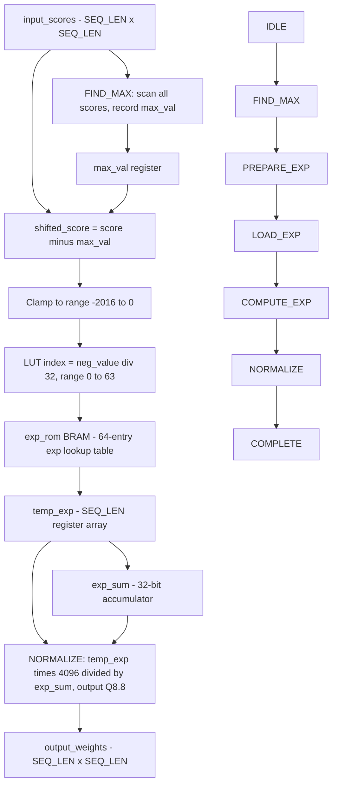
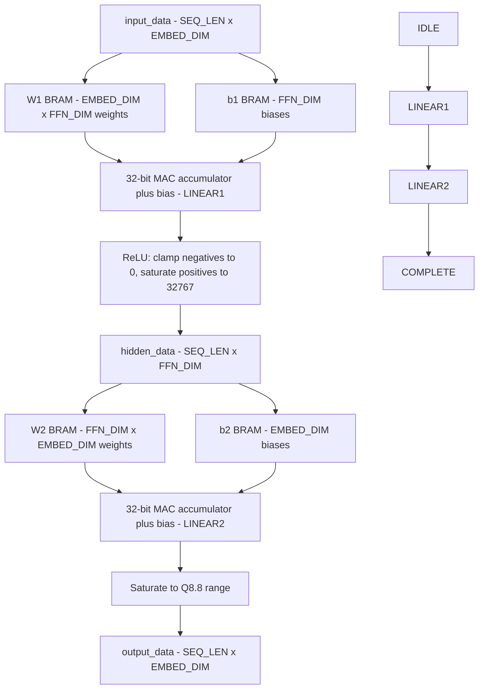
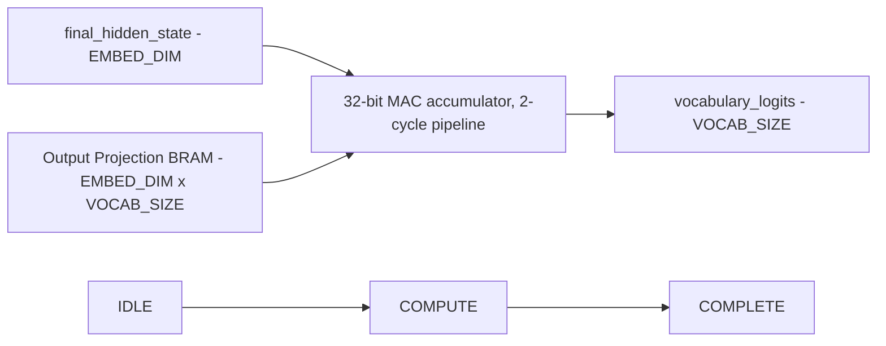
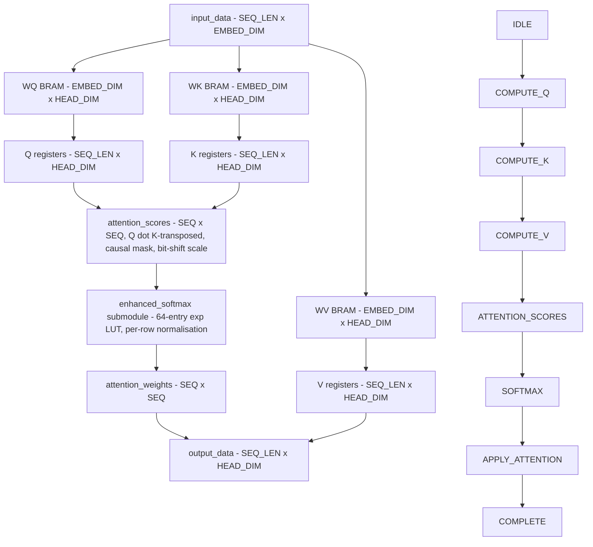

# Hardware Development — Part 2: Module Validation

## Overview

With the design synthesizing and placing on the board, the next phase was validating that the hardware actually computes the correct results. The original GenCore code contained multiple classes of bugs — not all of which prevented synthesis, but which would cause incorrect outputs at runtime. This section documents the validation framework and the systematic process of finding and fixing those bugs module by module.

## The Per-Module Test Framework

Rather than testing the complete design end-to-end immediately, a per-module test harness was built. Each of the ten RTL modules has:

- A **C++ Verilator test bench** (`v0/sim/cpp/test_<module>.cpp`) that drives inputs into the simulated module and captures outputs
- A **Python test driver** (`tests/test_<module>.py`) that runs the C++ simulation, computes the equivalent operation in PyTorch, and compares the results

The Python driver computes three metrics for each test:
- **Mean absolute error**: average magnitude of the difference between hardware and software outputs
- **Max absolute error**: worst-case difference across all output values
- **Pearson correlation coefficient**: a value of 1.0 indicates the hardware and software outputs are perfectly proportional; values below ~0.99 indicate a meaningful discrepancy

A shared `module_tester.py` class handles the mechanics of running the Verilator simulation, capturing stdout, and computing the metrics, so each per-module test script stays focused on setting up inputs and interpreting results.

The motivation for per-module testing is straightforward: if the end-to-end test fails, there is no way to know which of the ten modules is responsible. By testing each module in isolation, a failure immediately localizes the problem.

The framework was built incrementally. The first test — layer normalization — was written by hand to validate the framework itself before expanding to other modules. Once layer normalization confirmed the approach worked, the remaining test benches and Python drivers were generated with the help of Claude, with the shared `module_tester.py` class factored out at the same time. The test suite now covers all ten RTL modules.

### Intermediate Value Exposure

For complex modules like `attention_head`, it was not sufficient to just compare the final output — if the final output was wrong, the error could originate at any of five internal computation stages (Q projection, K projection, V projection, attention scores, softmax, attention application). To address this, additional output ports were added to expose intermediate values from within the module, allowing the test harness to compare hardware against software at each intermediate stage and pinpoint exactly where the error occurred.

## Bug Class: Non-Blocking Assignment Errors

The most pervasive bug class in the original code was a misuse of SystemVerilog's non-blocking assignment semantics. In synthesizable SystemVerilog, assignments to registers inside `always_ff` blocks are *non-blocking*: the new value is not visible until the next clock edge. A common mistake is to write a value to a register and then immediately read that same register in the same clock cycle — the read will return the *old* value, not the just-written one.

This mistake appeared repeatedly throughout the original design: in `feed_forward_network`, `positional_encoding`, `output_projection`, `attention_head`, and others. The fix in each case was to introduce an additional pipeline stage — an extra clock cycle between the write and the read — using either a new state in the module's FSM or an intermediate register.

## Module-by-Module Validation

### Layer Normalization

*Figure: Data-flow in `layer_normalization.sv`. The reciprocal-sqrt LUT (64-entry BRAM with leading-bit addressing) replaced a multi-stage combinational divider, eliminating the dominant source of timing slack and achieving 1.0 correlation.*



Layer normalization was the first module tested. The original implementation computed the reciprocal square root using a chained sequence of divisions, all performed combinationally (within a single clock cycle). This was both inaccurate and the likely dominant source of negative timing slack in the design — a complex combinational path that the clock had to wait for.

This was replaced with a **reciprocal square root lookup table**: a BRAM initialized with precomputed values, indexed by the quantized input. The lookup table introduces a one-cycle latency but eliminates the complex combinational path entirely.

The initial test run after this replacement showed 0.9813 correlation — good, but not the 1.0 expected for a pure table lookup with no approximation. The output range was also suspicious: PyTorch produced values in the range [-3.318, +4.704], while the hardware produced [-6.531, +9.273], a roughly uniform 2× scale error. Giving the hardware a controlled input of all-ones confirmed the same scaling pattern, pointing to a systematic error rather than random noise.

The culprit was a parameter mismatch in the test bench. The layer normalization module is parameterized by `EMBED_DIM`, which it needs to determine the size of the vectors being normalized. The test bench had not been given an explicit value, so it was defaulting to 64 — the original repository's embedding dimension — rather than the 16 being used in the cut-down design. With the wrong embedding dimension, the normalization was computing on a different vector size, producing the observed uniform scale error. After correcting the parameter in the test bench and the Makefile, layer normalization immediately reached **1.0 correlation**.

An interesting property of this lookup table: despite operating on quantized Q8.8 values (far coarser than float32), the correlation is exactly 1.0. The lookup process includes a leading-coefficient extraction step that compensates naturally for the quantization, producing results that match the reference within the noise floor of the fixed-point representation itself.

### Token Embedding

*Figure: Data-flow in `token_embedding.sv`. Each 6-bit token ID is multiplied by EMBED_DIM and used as a BRAM base address; the 2-cycle pipeline reads one Q8.8 weight per clock after the memory latency.*



Token embedding required no bug fixes — it passed at **1.0 correlation** on the first test run. It is the simplest module: a memory lookup with no arithmetic.

### Positional Encoding

*Figure: Data-flow in `positional_encoding.sv`. Cosine-based positional encodings are precomputed and stored in BRAM; the 3-stage pipeline inserts an idle cycle to let the BRAM output settle before the addition.*



Positional encoding failed initially due to a non-blocking assignment error. The module used a `pipe_stage` counter to manage multi-cycle memory reads, but an incorrect fix had been applied previously that caused the memory read to occur one cycle too early — before the address register had been updated. The fix was to shift the read by one additional cycle, allowing the updated address to propagate. After this correction: **1.0 correlation**.

The before/after in `positional_encoding.sv` (commit `60161e8`) is a two-line change that inserts one idle pipeline stage:

```systemverilog
// Before: pipe_stage 0 reads pos_data in the same cycle the address is presented
case (pipe_stage)
    0: temp_sum <= embedded_input[seq_idx][dim_idx] + $signed(pos_data);
    //  ^ BRAM output hasn't settled; pos_data still reflects the previous address
    1: position_encoded_output[seq_idx][dim_idx] <= temp_sum[15:0];
    2: begin pipe_stage <= 0; /* advance to next element */ end
endcase
```

```systemverilog
// After: pipe_stage 0 is an idle wait; pos_data is valid by pipe_stage 1
case (pipe_stage)
    0: ; // memory delay — allow BRAM output to settle
    1: temp_sum <= embedded_input[seq_idx][dim_idx] + $signed(pos_data);
    2: position_encoded_output[seq_idx][dim_idx] <= temp_sum[15:0];
    3: begin pipe_stage <= 0; /* advance to next element */ end
endcase
```

### Enhanced Softmax

*Figure: State machine and data-flow in `enhanced_softmax.sv`. The PREPARE_EXP → LOAD_EXP → COMPUTE_EXP loop iterates over each column of a row before advancing to NORMALIZE; the lower clamp bound of −2016 (not −2048) is the key correctness fix.*



Softmax uses an exponential function internally. The original implementation used a piecewise linear approximation that was coarse and inaccurate. This was replaced with a **64-entry exponential lookup table** stored in BRAM, indexed by the quantized input value.

The softmax result after this change achieved approximately **0.999 correlation** — not 1.0. This is expected and acceptable: an exponential function is a continuous curve, and a 64-entry lookup table cannot represent it perfectly. Adding linear interpolation between table entries would improve this further but would add hardware cost. The error is sufficiently small relative to the quantization noise already present in the Q8.8 representation.

#### The Softmax Clamp Bug

During end-to-end testing of `attention_head`, the softmax module unexpectedly produced bad correlation, even though it had passed standalone testing with near-perfect correlation. Investigation revealed a subtle boundary condition in the lookup table's input clamping.

The softmax exponential lookup table clamps its input to the range [-2048, 0] (in Q8.8 units). However, the correct lower bound for the table's indexing scheme — given how Q8.8 values are split to form the table address — is **-2016** (63 × 32), not -2048 (64 × 32). Values in the narrow range [-2048, -2016] were being mapped to an incorrect table entry.

This is a 32-entry gap out of a 2048-entry input range, which is why standalone testing with randomly distributed inputs rarely exposed it — the probability of hitting that range with random data is low. But attention score distributions are not random; they regularly produce values in the extreme negative range, making the bug manifest clearly in end-to-end testing.

The fix was to hard-code the lower clamp bound to -2016. After this correction, softmax achieved its expected ~0.999 correlation in the full attention context.

This is a good illustration of why unit testing alone is insufficient: a bug that is essentially invisible in isolation becomes conspicuous in integration.

### Feed Forward Network

*Figure: Two-layer data-flow in `feed_forward_network.sv`. The hidden layer (FFN_DIM = 64) is held in flip-flop registers; both layers share identical MAC-accumulate-bias-saturate structure and both required the same non-blocking assignment fix.*



The FFN is a two-layer linear transformation with bias and activation. Both layers share essentially identical structure: loop over the weight matrix, accumulate the dot product, add the bias, then apply the activation and pass to the next layer.

The initial test run was striking: mean error 0.75, max error 2.12, and a Pearson correlation of **-0.0229** — essentially the output had no relationship to the expected values whatsoever, or worse, an inverted one. This level of failure ruled out a subtle quantization issue and pointed to something structurally wrong.

The cause was a non-blocking assignment error in the accumulator logic. The FFN accumulates a partial sum over multiple clock cycles and then adds the bias to the accumulated value. The original code tried to do both in the same cycle: write the accumulated value, then immediately read it to add the bias. Due to non-blocking semantics, the read returned the old (pre-accumulation) value rather than the just-written one.

The original `LINEAR1` state in `feed_forward_network.sv` (before commit `d57d60d`):

```systemverilog
// Before: accumulator updated and read in the same clock cycle
if (pipe_stage >= 2) begin
    accumulator <= accumulator + (input_data[seq_idx][in_dim] * $signed(w1_data));
    pipe_stage  <= 0;
    if (in_dim == EMBED_DIM - 1) begin
        with_bias <= (accumulator >>> 8) + $signed(b1_data);
        //           ^ non-blocking: accumulator still holds the previous value here
        if (with_bias > 32767)
            hidden_data[seq_idx][hidden_dim] <= 16'h7FFF;
        //  ^ with_bias was written above in the same cycle — same problem again
```

The fix adds two extra pipeline states to break the chain: one cycle for the accumulator to settle, a second for `with_bias`:

```systemverilog
// After: three distinct pipeline stages (commit d57d60d)
case (pipe_stage)
    2: accumulator <= accumulator + (input_data[seq_idx][in_dim] * $signed(w1_data));
    3: begin  // accumulator is now the updated value
        pipe_stage <= 0;
        if (in_dim == EMBED_DIM - 1) begin
            with_bias  <= (accumulator >>> 8) + $signed(b1_data);
            pipe_stage <= 4;
        end else in_dim <= in_dim + 1;
    end
    4: begin  // with_bias is now correct
        pipe_stage <= 0;
        if (with_bias > 32767)
            hidden_data[seq_idx][hidden_dim] <= 16'h7FFF;
        ...
    end
endcase
```

Both `LINEAR1` and `LINEAR2` had identical structure and required the same fix.

Fixing the first layer's timing initially appeared to make results *worse* — and on one attempt, the test timed out after 2 million simulation cycles with the module stuck in a state machine loop, the result of an incorrectly introduced state transition. The fix was backed out and reapplied more carefully. The second layer had the same structural error and required the same fix. After correcting both layers: **1.0 correlation**.

### Output Projection

*Figure: Data-flow in `output_projection.sv`. A single matrix-vector multiply (final hidden state against the learned token weight matrix) produces one logit per vocabulary entry; the 2-cycle pipeline accommodates the BRAM read latency.*



Output projection multiplies the final hidden state by a learned weight matrix to produce vocabulary logits. The first test run showed poor correlation — not from a computation error, but from a **memory layout mismatch**.

PyTorch stores weight matrices in row-major order (C-contiguous layout). The hardware was reading the `.mem` file assuming a different layout, effectively transposing the matrix. The fix was applied in the weight export step (`gen_luts.py`): before saving, weight matrices are reshaped and transposed so that the hardware reads them in the correct order. Bias vectors are *not* transposed — they are 1-D and layout-independent. After this fix: **1.0 correlation**.

### Argmax

Argmax is the simplest module — it iterates over the vocabulary logits and outputs the index of the maximum value. It passed **20/20 test cases on the first run** with no changes required.

### Attention Head

*Figure: Internal data-flow and state machine of `attention_head.sv`. The 32-bit MAC accumulator is shared across all six compute states; `enhanced_softmax` runs as a blocking submodule during the SOFTMAX state.*



Attention head is the most complex module, internally performing five sequential matrix multiplications (Q, K, V projections, attention score computation, and weighted sum application) plus a softmax pass. It was also the most difficult to debug, for a reason that became clear early: with this many sequential operations, a failure in any one stage corrupts every stage after it, making the final output useless as a diagnostic signal.

**Intermediate value exposure.** The initial test runs with both PyTorch memory layout and hardware addressing layout both produced poor correlation — which meant the standard layout-swapping fix that worked for `output_projection` was not the issue here. To make progress, the test bench was extended to expose intermediate values from within the module: after each of the Q, K, V projections, after the attention score computation, and after the softmax. This made it possible to compare hardware against software at each stage and see exactly where the error first appeared.

**Parameter propagation bug.** With intermediate values exposed, all three projections (Q, K, V) were immediately flagged as failing. The cause was a missing parameter: the module accepts a `HEAD_DIM` parameter, but this was never being passed down from the parent `multi_head_attention` module. The parameter silently defaulted to 8. With 4 attention heads and a 16-dimensional embedding, the correct head dimension is 16/4 = 4. Operating at the wrong dimension produced systematically wrong matrix dimensions throughout the Q/K/V projections. The fix was to compute `HEAD_DIM = EMBED_DIM / NUM_HEADS` explicitly at the top level and pass it down. After this change, all three projections jumped to **1.0 correlation**.

**Non-blocking assignment errors in Q/K/V projections.** Each projection also had the familiar register write/read timing issue. The Q projection used a combinational wire (`next_accum`) for its accumulation, but the K and V projections omitted this and read `accumulator` directly in the same cycle it was written. The fix in commit `cfb8ac8` introduces separate wires for each projection:

```systemverilog
// Before: single combinational wire only used for Q; K and V read the register directly
wire [31:0] next_accum = accumulator + (input_data[seq_idx][embed_idx] * $signed(wq_data));
// ...
COMPUTE_K: begin
    if (pipe_stage >= 2) begin
        accumulator <= accumulator + (input_data[seq_idx][embed_idx] * $signed(wk_data));
        if (embed_idx == EMBED_DIM - 1)
            K[seq_idx][head_idx] <= 16'(accumulator >>> 8);
            //                          ^ stale — the line above hasn't taken effect yet
```

```systemverilog
// After: one combinational wire per projection (commit cfb8ac8)
wire [31:0] next_accumq = accumulator + (input_data[seq_idx][embed_idx] * $signed(wq_data));
wire [31:0] next_accumk = accumulator + (input_data[seq_idx][embed_idx] * $signed(wk_data));
wire [31:0] next_accumv = accumulator + (input_data[seq_idx][embed_idx] * $signed(wv_data));
// ...
COMPUTE_K: begin
    if (pipe_stage >= 2) begin
        if (embed_idx == EMBED_DIM - 1)
            K[seq_idx][head_idx] <= 16'(next_accumk >>> 8);
            //                          ^ combinational — reflects the current cycle's product
        else accumulator <= next_accumk;
```

After this fix, all three projections jumped to **1.0 correlation**.

**Score shift.** The attention score computation requires scaling by the square root of `HEAD_DIM`. The hardware approximates this with bit shifts, which introduces a uniform scaling error when `HEAD_DIM` is not a perfect square. This error is harmless: the softmax operation immediately following normalizes relative values, and a uniform multiplicative scale across all attention scores cancels out through the normalization. The correlation at this stage reaches ~1.0.

**Softmax clamp bug (see above).** Once the Q/K/V and score issues were fixed, the softmax clamp edge case became the remaining source of error. After the -2016 clamp fix, attention head correlation reached **~0.98+**. The residual error reflects the accumulation of quantization noise and softmax approximation error across multiple matrix multiplications — an inherent property of Q8.8 arithmetic at this depth, not a fixable bug.

### Multi-Head Attention

Multi-head attention is primarily a structural wrapper around `attention_head` — it instantiates N heads, starts them simultaneously, concatenates their outputs, and applies the output projection. One non-blocking assignment issue was found and fixed in the wrapper itself. After the fixes to `attention_head` propagated through, multi-head attention reached **~0.98+ correlation** — consistent with the accumulated error from its constituent attention heads.

### Complete Transformer Decoder (End-to-End)

With all individual modules validated, an end-to-end test was run using `test_complete_transformer_decoder.py`. This test runs the full inference pipeline in Verilator, compares intermediate values at every module boundary, and reports the final predicted token.

**Memory layout in the full pipeline.** The first end-to-end run revealed one more layout issue. The per-module tests for `attention_head` had correctly handled the PyTorch-to-hardware transposition for the weight files, but the full-pipeline test was loading weights differently — the transposition was not being applied consistently across all weight files. After applying the same reshape-and-transpose transformation to all attention weight matrices in `gen_luts.py` (while leaving bias vectors untransposed, as they are 1-D and layout-independent), attention head correlation in the full pipeline improved substantially.

**The dog token edge case.** Initial end-to-end testing was done with a model trained on only 500 sentences. Most inputs worked well, but the prompt `the dog` produced garbage output — the hardware and software diverged sharply at the final logit stage, with correlation dropping to ~0.57. The diagnosis was that the dog token's embedding had been pushed outside the representable Q8.8 range during training on too little data: with only 500 training examples, the distribution of the token embeddings was not well-constrained, and some embeddings drifted to values that the 8.8 fixed-point format could not accurately represent.

Retraining on 5,000 sentences resolved the issue completely. With the larger training set, the dog token's embedding stayed within range and the hardware-software correlation jumped to **1.0** for that test case. This is a practical lesson about the relationship between training data scale and quantization: a model that works fine in floating point can fail in hardware if the training distribution allows embeddings to drift outside the fixed-point representable range.

**Final results.** After training on 5,000 sentences, the end-to-end test showed final logit correlations of **0.9996 or higher** across all four test cases. The hardware and software predicted the same token in most cases. In the one case where they differed (`a cat runs`), the top-five logit rankings were identical between hardware and software — the divergence was in which of the two top-ranked tokens each selected, suggesting a very small absolute logit difference at the boundary.

End-to-end hardware outputs (from Verilator simulation with the trained model):
- Input `the` → `the cat sleeps gently`
- Input `the cat` → `the cat sleeps gently`
- Input `the dog` → `the dog jumps gently`
- Input *(nothing)* → `the tall fish jumps gently`

## Bug Fix Freeze

The bug fix freeze was declared at approximately 6:00 AM on May 30. At that point, all individual module tests were passing at their expected correlation levels, and the end-to-end test was producing valid grammatical sentences.
